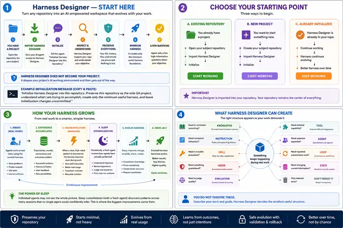

# Harness Designer

A minimal, domain-agnostic seed harness that progressively learns an objective and evolves the AI working environment around it.

The user should not need to know how to design an agent harness. They describe what they are trying to accomplish; the seed discovers the subject, starts useful work, observes recurring patterns and progressively places durable improvements into the right harness primitive.



## Core principle

**Harness Designer is a shaping source, not the finished project repository.**

The subject repository owns its Git identity, remote, history and project files. Harness Designer contributes the minimum foundation and then gets out of the way.

```text
subject repository
      +
Harness Designer seed
      ↓
safe initialization
      ↓
subject-specific minimum harness
      ↓
real work
      ↓
online discoveries + accumulated trajectories
      ↓
classify / candidate / test
      ↓
periodic sleep consolidation
      ↓
review outcomes → abstract → prune → improve → validate
      ↓
more coherent specialized working environment
```

## Initialization modes

### Existing subject repository — recommended

If the project already exists:

1. Open or clone the **subject repository**.
2. Give the agent access to Harness Designer as a temporary source, or tell it to fetch/clone Harness Designer temporarily.
3. The repository initializer preserves the subject `.git`, origin, history, README, license and existing project files.
4. It imports only the minimum harness foundation.
5. It validates the resulting repository and removes temporary Harness Designer material.
6. Initialization changes remain uncommitted and unpushed unless explicitly requested otherwise.

### Started from a Harness Designer clone

This is also supported. If the user later identifies a different repository as the actual subject, the agent must treat the Harness Designer clone as temporary shaping material and establish the subject repository as the sole project Git repository before continuing.

Harness Designer's `.git` directory, remote and history must not become the subject repository's identity.

### New subject with no repository yet

Establish the intended subject repository first, then import the minimum seed. Do not silently make `Wolfrine/Harness_Designer` the new project's upstream repository.

## Subject bootstrap

After repository identity is correct:

1. A new agent session reads `AGENTS.md`.
2. The bootstrap skill asks a few adaptive, high-information questions about the objective and current situation.
3. Bootstrap asks once whether the user wants the optional **Harness Dashboard**.
4. The agent records only the minimum useful subject model and creates the smallest harness needed to begin.
5. If the dashboard is enabled, the LLM generates a subject-specific local dashboard from Harness Designer's basic dashboard contract.
6. Real work starts.
7. As work continues, durable patterns can become knowledge, instructions, skills, hooks, evaluations, tools, specialist agents, loops, state or trajectory/evidence.
8. Harness changes are reviewed for value, duplication and staleness instead of accumulating forever.

The subject can be known while the objective remains in bootstrap. Do not invent objective details merely to complete setup.

## Optional Harness Dashboard

Harness Designer can create a local dashboard that makes the agentic workspace understandable without reading every chat or raw transcript.

If the user opts in, the LLM generates a dashboard suited to the subject using `templates/dashboard/DASHBOARD_SPEC.md` rather than copying a rigid finished UI.

Depending on the subject, it can show:

- agent sessions and activity over time;
- open continuation points;
- parallel/forked work;
- tools, skills, files and sub-agents involved;
- harness changes and evolution candidates;
- review and sleep-consolidation history.

When durable repository-local history is useful, Harness Designer can maintain one trajectory/evidence shard per session under `.harness/trajectory/sessions/`. One shard per session keeps parallel agents from contending over a single log file.

Mechanical evidence such as timestamps, tool use and files touched is kept distinct from model-written interpretation such as summaries, outcomes and open threads. The dashboard is a view over this evidence, not the canonical source of project state.

The dashboard is optional and can be enabled later if declined during bootstrap.

See `skills/harness-dashboard/SKILL.md` and `.harness/trajectory/README.md`.

## Two evolution modes

### Online evolution

During active work, clear high-confidence discoveries can improve the harness directly through candidate-first design. This is suitable for explicit durable user instructions, obvious missing procedures, repeated known needs and high-consequence invariants.

### Sleep evolution

Some improvements only become visible across multiple agent trajectories. Harness Designer therefore includes an offline consolidation mechanism inspired by the separation between active work and biological sleep.

A sleep cycle preferably starts with a **fresh agent/session** that did not produce the recent work. It independently reconstructs the objective and current harness, then reviews several recent trajectories and asks whether the harness caused agents to produce meaningful outcomes.

It can then:

- identify recurring failure or success patterns;
- consolidate repeated patches into better abstractions;
- simplify, merge or retire stale harness components;
- create candidate instructions, skills, tools, hooks, agents, loops or evaluations;
- regression-test candidate mutations before promotion.

Sleep is evidence-triggered rather than a mandatory fixed schedule. Existing conversations, runtime trajectories, optional `.harness/trajectory/` evidence, Git history, evaluations and user feedback should be used before creating additional logging machinery.

During candidate experimentation, unrelated real-world subject actions should be isolated when practical. Experimental self-modification should not automatically inherit production authority.

See `skills/harness-sleep/SKILL.md`.

## Repository structure

```text
AGENTS.md                  Agent entrypoint and minimal operating contract
.harness/
  manifest.yaml            Current harness identity, maturity and observability state
  objective.md             Evolving statement of objective and constraints
  architecture.md          Placement, evolution and repository-identity rules
  evolution/README.md      Candidate → active → revised/retired lifecycle
  trajectory/README.md     Optional durable agent trajectory/evidence contract
skills/
  repository-initializer/  Safely shapes the actual subject repository
  bootstrap/               First-run subject discovery + dashboard choice
  harness-designer/        Converts durable online patterns into harness structure
  harness-review/          Consolidates and prunes harness structure
  harness-sleep/           Offline trajectory review and harness consolidation
  harness-dashboard/       Generates optional subject-specific observability dashboard
hooks/
  session-start.md         Portable start-of-session lifecycle contract
  session-end.md           Portable end-of-session + optional trajectory/dashboard contract
templates/
  dashboard/               Minimal dashboard generation contract + session-shard example
  ...                      Other lightweight primitive templates
```

## Harness primitives

| Need discovered during work | Prefer |
|---|---|
| Stable fact/reference material | Knowledge/docs |
| Stable behavioral principle | Instruction |
| Reusable procedure | Skill |
| Something that must deterministically happen | Hook |
| Objective quality criterion | Evaluation |
| External capability | Tool/connector |
| Independent specialist reasoning | Agent |
| Repeated or autonomous process | Loop |
| Mutable current position | State |
| Durable evidence of what agents did/outcomes | Trajectory / evidence |
| One-off context | Keep in the conversation |

The smallest adequate primitive wins.

## Philosophy

The seed should stay small. Do not preload dozens of generic skills or rules. Specialization should be earned through the objective and actual work.

Harness quality is judged by **meaningful outcomes**, not merely by whether agents followed instructions.

Lifecycle hooks are contracts rather than platform-specific configuration. Adapters can map them into Codex, Claude Code, Cursor or another runtime when native hook behavior is useful.

The project should evolve from evidence gathered through real usage, including comparison against mature harnesses and feedback from people starting new subjects from this seed.
